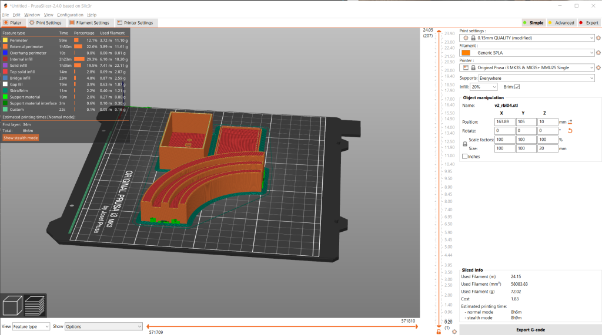

# RainbowLamp
3D model for a RGB color changing LED lamp.

## 3D model
The 3D model was created using [DesignSpark Mechanical](https://www.rs-online.com/designspark/mechanical-software). The source files as well as STLs are included.
You need to print one of each piece:
- **v2_rbl04**: the lamp arc
- **v2_box03**: the base and battery holder
- **v2_bottom02**: a lid for the battery holder (in my print it stays on just with press fit)

### Printing Parameters
I printed my version with white SuperPLA (215C nozzle, 70C bed), 20% infill, brim active and supports everywhere. The surface orientation was as shown below.

## Other parts
You will also need:
- 7 RBG color changing LEDs (I used LEDs from [blinkyparts](https://shop.blinkyparts.com/en/detail/76374904542142cbb9d4bba147246f99))
- A battery holder (I used a double AA one as shown below)
- 2x M3x6mm screws
- 2x M3 nuts

# Assembly

The arc can be attached to the base on both ends. This way you can e.g. form a half circle or use an arc on both ends of a bookshelf.
- clean the printed parts (I used a knife and a small screwdriver)
- put in the LEDs with the longer wire on the outside of the arc
- start bending the wires from the farthest LED in the direction of the end where you want to attach the base
- repeat for all LEDs
- the wires should be barely long enough to build up a solder chain as shown on the picture
- shorten the wires of the LED at the base ~5mm
- puth the wires of the battery holder through the middle hole in the base
- solder the red wire to the LED wire on the outside of the arc
- solder the black wire to the LED in the inside of the arc
- puth the nuts into the holes in the arc and attach the base with the M3x6 screws
- put in some AA cells to test if everything works
- optional: put some hot glue on the back pf the LEDs to make sure that stay in place (please ignore the butchering in my picture, my gun failed)

# License
The contents of this repository is licensed under [CC BY-SA 4.0](https://creativecommons.org/licenses/by-sa/4.0/), see LICENSE.md for details.

# Contact
You can find me on [Twitter](https://twitter.com/dec_hl) if you want...
